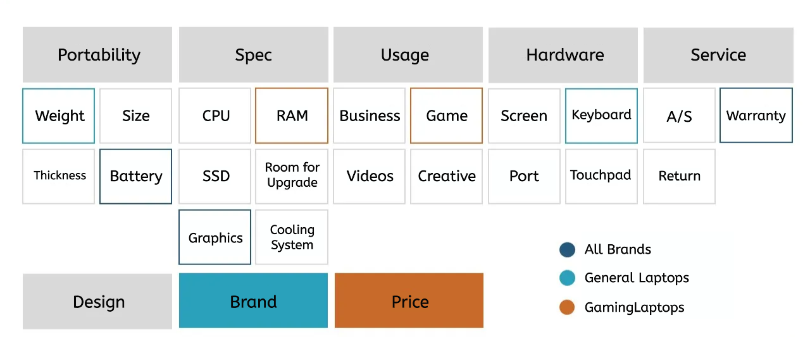

# Positioning Razer in the Laptop Market: Consumer Insights Through Topic Modeling

## 1. 🔍 Project Overview

| Item | Description |
| --- | --- |
| **Background** | Razer is a global lifestyle brand for gamers, best known for its premium gaming laptops such as the Blade series. While Razer made a revenue increase of around $400 million YoY in 2021, its market share in the whole laptop sector is still weak. **This project aims to develop strategies that could strengthen Razer’s position in the market.** |
| **Role** | Review web scraping, market research, topic modeling, strategic recommendation |
| **Duration** | Oct 13, 2023 ~ Nov 28, 2023 |
| **Team** | 4 members |

## 2. 🎯 Problem Statement

- **Goal**:
    1. Identify key factors that influence consumers' laptop purchases
    2. Analyze Razer’s characteristics and position in the market, and identify suitable peer companies
    3. Propose competitive strategies against selected peers

## 3. 🗃️ Data Description

- **Amazon Review Data**:
    
    : Web scraped reviews of flagship laptops from 10 major manufacturers, including Razer, from Amazon (most relevant platform for Razer’s core market in the Americas)
    

| Variable | Description |
| --- | --- |
| `customer_id` | Customer ID |
| `rating` | Star rating |
| `title` | Review title |
| `country` | Country of review |
| `date` | Review date |
| `content` | Review body |
| `helpful` | Helpful vote count |
| `product_name` | Product name |
| `company` | Manufacturer |

## 4. 🛠 Tools & Libraries

- **Environment**: Python, Jupyter Notebook
- **Libraries**: Pandas, NumPy, Matplotlib, Seaborn, Selenium, Scikit-learn, Gensim, NLTK, Wordcloud, time, datetime, random

## 5. 🧩 Analysis & Modeling Summary

> 📌 Using Topic Modeling (LDA), identify what consumers prioritize when choosing a laptop and figure out Razer’s strengths and weaknesses.
> 
- Optimal number of topics selected via coherence score
- Separated analysis between **general laptops** and **gaming laptops**
- Razer reviews analyzed by **all**, **5-star**, and **1-star** to distinguish strengths vs pain points

### 1) Data Preprocessing

- **Non-English reviews excluded** for consistency:
    - Removed reviews from non-English-speaking countries (based on `country`)
    - Filtered out reviews with foreign words (e.g., "que", "muy")
- **Tokenization**: Combined review title and body
- **Stopword removal** using NLTK + Scikit-learn + custom list (e.g., "laptop", "computer", "amazon", "apple")

### 2) Identify Consumer Priorities

|  | All Brands | General Laptop Brands | Gaming Laptop Brands |
| --- | --- | --- | --- |
| Avg. Rating | 3.5 | 3.7 | 3.4 |
| Avg. Helpful Votes | 5.2 | 9.3 | 4.1 |

- **Notable Keywords**:
  
  |  | All Brands | General | Gaming |
  | --- | --- | --- | --- |
  | Use Purpose | game | – | game, play |
  | Hardware | screen, keyboard, light | screen, keyboard, light | screen, keyboard |
  | Battery | battery, power | battery, power, charge | battery, power |
  | Price | price | price | price |
  | Issues | issue, problem | – | issue |
  | New Product | – | new | – |
  | Specs | – | – | ram |

- **LDA Topic Modeling Insights**:

  💡 Consumers prioritize **battery performance, price, and return services**.
  
  General laptop buyers favor **lightweight, fast** devices, while gaming laptop buyers care more about **performance with game, battery durability**, and **customer service reliability**.
  
  - **All Brands**:
      - Game performance: `game, work, run, fan`
      - Return/service issues: `return, work, issue`
      - Price & battery: `price`, `battery, life, game`
  - **General Laptops**:
      - Battery & usability: `use, love, work, battery`
      - Lightweight: `screen, light, fast`
  - **Gaming Laptops**:
      - Gameplay performance: `game, battery`
      - Warranty, return: `month, warranty, return`

### 3) Razer Analysis

- Avg. Rating: 3.4 (slightly below overall avg.)
- **Notable Keywords**:

  |  | All Reviews | 5★ Reviews | 1★ Reviews |
  | --- | --- | --- | --- |
  | Use Case | game | game, play | game |
  | Hardware | screen, keyboard, fan | screen, keyboard, fan | screen |
  | Battery | battery, power | battery, power | battery, power |
  | Price | price | – | – |
  | Issues | issue, support, problem | – | support, customer, issue, return, warranty |
  | Quality | quality, performance | performance | – |

- **LDA Topic Modeling Insights**:

💡 Razer excels in **gaming performance, battery, and keyboard**, but is **poor after-sales support** is being problematic.

  - **All Reviews**:
      - Performance: `game, work, great`
      - Screen, Battery, Keyboard
  - **5-Star Reviews**:
      - Game: `game, great, like`
      - Keyboard, Battery
  - **1-Star Reviews**:
      - After-sales service: `support, return, service`

## 6. 💡 Conclusion

### 1) Laptop Purchase Drivers

Consumers consider portability, performance, functionality, ease of use, customer service, design, brand reputation, and price.

### 2) Razer Positioning & Peer Company Selection

Based on market characteristics, **HP, Dell, and ASUS** were chosen as peers.

| Criteria | Companies Excluded |
| --- | --- |
| Razer's key market: US | Samsung, LG (low US share) |
| Gaming focus | Microsoft, Apple (no gaming laptops) |
| Premium image | Acer, Lenovo (budget reputation) |

### 3) Strategic Recommendations

1. **Enhance Customer Support**
    - Expand offline stores (currently <20 worldwide)
    - Partner with retail service providers for local support
    - Improve online support channels
2. **Stick to Premium Brand Identity**
    - Rather than launching budget models, highlight Razer-exclusive gaming tech (e.g. HyperPolling for ultra-responsive gameplay)
3. **Expand to Asian Markets**
    - Tap into fast-growing Asian e-sports scene
    - Leverage brand ambassadors & partnerships for localized marketing

## 7. 🧠 Reflections

- Topic modeling isn’t just about extracting topics, but it's about **how we interpret the results**. I've learned interpreting the results **clearly and objectively** is critical in this analysis.
- Some insights came more from desk research than the data itself. I want to explore ways to **extract richer meaning from textual data.**
- I've realized how important **background knowledge about the company and the industry** is for data analysis to be useful in real world.
